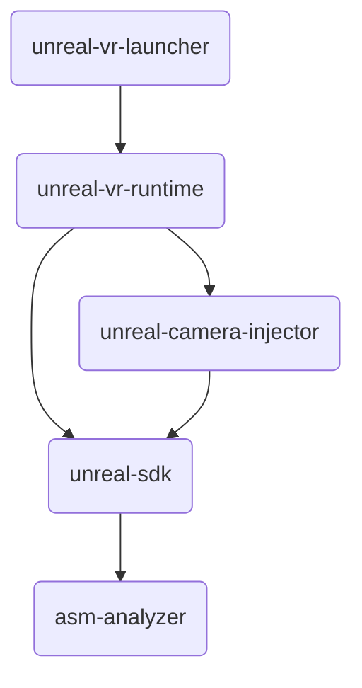

# UnrealVR

Adds virtual reality support to flatscreen Unreal Engine games

## Releases

None yet. Private alpha tests went okay, but the mod isn't stable enough to release publicly yet

## Rewrite

I'm rewriting literally every component (launcher, libs, core) in Rust. You can find the previous C++ version under a
different branch. That readme has more details on implementation, features, etc.

## Modules

| Module                   | Description                                                                 |
|--------------------------|-----------------------------------------------------------------------------|
| `asm-analyzer`           | Analyzes a game binary's assembly to search for core functions              |
| `unreal-sdk`             | Maps several Unreal C++ classes/functions to Rust, allowing further modding |
| `unreal-camera-injector` | Injects a camera + custom render target into a game                         |
| `unreal-vr-runtime`      | An injectable library that adds hooks to a game, creating VR support        |
| `unreal-vr-launcher`     | A GUI to manage the runtime                                                 |

