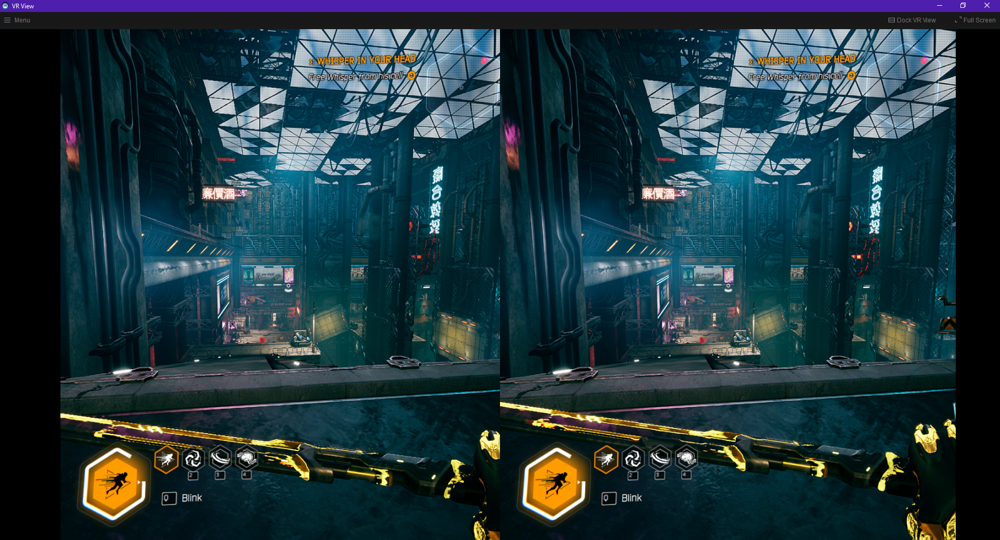

# UnrealVR

Adds virtual reality support to flatscreen Unreal Engine games

## Features

- **OpenXR**: Works on any PC VR headset (SteamVR, Oculus, WindowsMR, etc.)
- **DirectX 11**: Compatible with the vast majority of Unreal Engine 4 games
- **Universal to Unreal Engine 4**: Works on any version of the game engine
- **Stereoscopic Perspective**: Presents a real 3D effect, rather than a flatscreen that is placed in VR
- **Configurable Profiles**: Create and share game configurations using the built-in editor
- ... will update with more feature descriptions once they are working

## Preview

Sneak peek below 👀

## Contribute

If you have any ideas for features, or want to implement a feature yourself, please email me or send a DM on Discord to
TheNewJavaman#3966.

I currently use Rider 2022.1 EAP to develop this project and Visual Studio 2022 Preview to develop the launcher (all using Visual Studio 2022 build tools). You can get a
free license of Rider by downloading the EAP version via JetBrains Toolbox. Rider versions <2022.1 don't have C++ support merged into mainline.

Note: VS 2022 is necessary for some tasks:
- Compiling HLSL shaders; there are a few custom settings, contact me for more info
- Profiling C++ code
- Developing the WinUI interface; Rider does not support WinUI 3, nor Hot Reload