# UnrealVR

**No releases yet**

Adds virtual reality support to flatscreen Unreal Engine games

## Features

- **Stereoscopic Rendering**: Presents the game in full 3D, not a flatscreen in VR
- **6 Degrees of Freedom**: Headset movement and rotation is tracked in-game
- **Configurable Profiles**: Save and share your settings for each game

## Coming Soon

- **Input Binding**: Map VR controller buttons to game actions
- **Controller Tracking**: Link hand movement to in-game objects
- **Synchronized Rendering**: Renders both eyes at the same time, reducing discomfort

## Service Structure

### Service Explanations

| Service  | Description                                                                                  |
|----------|----------------------------------------------------------------------------------------------|
| UnrealVR | Handles mod logic at a high level                                                            |
| Pipe     | Communicates with the app UI (launcher)                                                      |
| Logging  | Flushes the buffered log to the pipe                                                         |
| Graphics | Interacts with D3D11 (and D3D12 in the future)                                               |
| XR       | Interacts with OpenXR                                                                        |
| Engine   | Interacts with the application's game engine (Unreal Engine 4/5, maybe others in the future) |

### Service Logic

```mermaid
sequenceDiagram
  participant main as UnrealVR Service
  participant pipe as Pipe Service
  participant log as Logging Service
  participant xr as XR Service
  participant graphics as Graphics Service
  participant engine as Game Engine Service
  
  rect rgba(0, 0, 0, 0.2)
  note left of main: 1. Init pipe
  activate main
  note over main: DllAttach called
  main->>pipe: Init
  activate pipe
  note over pipe: Open pipe
  pipe-->>main: 
  note over pipe: Async
  loop
  pipe-)pipe: Listen for commands
  end
  deactivate pipe
  main->>log: Init
  activate log
  log-->>main: 
  deactivate main
  note over log: Async
  loop
  log-)log: Flush buffer
  end
  deactivate log
  end
  
  rect rgba(0, 0, 0, 0.2)
  note left of main: 2. Init game
  activate pipe
  note over pipe: SettingsInitialized received
  pipe->>main: OnPipeSettingsInitialized
  activate main
  main-->>pipe: 
  deactivate pipe
  note over main: Async
  main->>xr: Init
  activate xr
  note over xr: Start XR session
  note over xr: Register input handlers
  note over xr: Create swapchain resources
  xr-->>main: 
  deactivate xr
  main->>graphics: Init
  activate graphics
  note over graphics: Hook swapchain present
  graphics-->>main: 
  deactivate graphics
  main->>engine: Init
  activate engine
  note over engine: Hook game tick
  engine-->>main: 
  deactivate engine
  deactivate main
  end
  
  rect rgba(0, 0, 0, 0.2)
  note left of main: 3a. Update XR
  activate graphics
  note over graphics: Present hook called
  graphics->>main: OnSwapchainPresent
  activate main
  note over main: Mutex
  main-->>graphics: 
  deactivate graphics
  note over main: Async
  note over main: Switch GPU eye
  main->>xr: GetFrame
  activate xr
  opt Left eye
  note over xr: Begin frame
  note over xr: Cache poses
  end
  note over xr: Get render surface
  xr-->>main: 
  deactivate xr
  main->>graphics: ConvertFrame
  activate graphics
  note over graphics: Render fullscreen quad
  graphics-->>main: 
  deactivate graphics
  main->>xr: SubmitFrame
  activate xr
  note over xr: Submit render surface
  opt Right eye
  note over xr: End frame
  end
  xr-->>main: 
  deactivate xr
  deactivate main
  end
  
  rect rgba(0, 0, 0, 0.2)
  note left of main: 3b. Update game
  activate engine
  note over engine: Tick hook called
  engine->>main: OnGameTick
  activate main
  note over main: Mutex
  main-->>engine: 
  deactivate engine
  note over main: Async
  note over main: Switch CPU eye
  main->>xr: GetPose
  activate xr
  deactivate xr
  xr-->>main: 
  main->>engine: UpdatePose
  activate engine
  note over engine: Update camera FOV
  note over engine: Update camera rotation
  opt
  note over engine: Update player aim
  end
  note over engine: Update camera location
  deactivate main
  engine-->>main: 
  deactivate engine
  end
  
  rect rgba(0, 0, 0, 0.2)
  note left of main: 4. Stop
  alt
  activate main
  note over main: DllDetach called
  else or
  activate pipe
  note over pipe: Stop received
  pipe->>main: OnPipeStop
  main-->>pipe: 
  deactivate pipe
  note over main: Async
  end
  main->>engine: Stop
  activate engine
  note over engine: Remove tick hook
  engine-->>main: 
  deactivate engine
  main->>graphics: Stop
  activate graphics
  note over graphics: Remove present hook
  note over graphics: Release conversion resources
  graphics-->>main: 
  deactivate graphics
  main->>xr: Stop
  activate xr
  note over xr: Release swapchain resources
  note over xr: Unregister input handlers 
  note over xr: Shutdown XR session
  xr-->>main: 
  deactivate xr
  main->>log: Stop
  activate log
  deactivate log
  log-->>main: 
  main->>pipe: Stop
  activate pipe
  note over pipe: Close pipe
  pipe-->>main: 
  deactivate pipe
  deactivate main
  end
```

## Improvements

There are so many features I want to add, and so many refactorings that could improve the code.

- **Input Binding**: Map VR controller buttons to game actions via keyboard/mouse/gamepad input. Add a button to reset
  the view rotation/position.
- **Controller Tracking**: Link hand movement to in-game objects. Make them rotate and move according to how your
  hands move. Allow configurable offsets for the UI so that it feels like your hand is holding a gun, for example.
- **Synchronized Rendering**: Renders both eyes at the same time, reducing discomfort. This one isn't as important
  because the mod seems to perform pretty well so far. But at lower framerates, some people may experience discomfort is
  the positions of objects aren't aligned for the left/right eyes.
- **Optimization**: Do more profiling to increase framerate. VR should be accessible to as many people as possible, so
  we as a community need to make sure that our mods aren't too limited by hardware.
- **VR For All**: Abstract the graphics, VR, and game engine services into interfaces that can be implemented for other
  graphics APIs/VR runtimes/game engines; this will definitely be necessary for D3D12, and if I want to add support
  Vulkan/OpenGL, it'll be even more important. Probably won't be used for other game engines, but if someone uses a game
  engine written in any language that can interop with C++, imagine the possibilities! Probably not useful for VR,
  though, since OpenXR is the future... hopefully there won't ever be a replacement VR runtime that I'll have to add
  support for.
- **UE Version Detector**: Reduces the configuration necessary for new games. Would use the same information as the
  Details pane in File Explorer to determine the Unreal Engine version.
- **Console Output**: Enable/disable the log window; also, don't use a basic terminal for output, show it in the
  nice-looking app UI.
- **Unreal Engine 5**: It's not too different from UE4, so add support to UML if Russell.J doesn't have time
- **Build System**: Use meson so it's faster and cross-platform. Would also reduce dependence on Rider/Visual Studio
- **Stop Using UML**: Build a home-grown solution that's better for this specific use-case
- **Dependency Injection**: Inject service class instances at runtime so there aren't as many static members

## Preview

## Contribute

If you have any ideas for features or want to implement a feature yourself, please email me or send a DM on Discord to
TheNewJavaman#3966.

### Development Tools

- **Rider 2022.1 EAP**: For writing C++ code; it has a much better code formatter than Visual Studio, is much faster,
  and has superior refactoring capabilities. Also supports Python for the rizin script. Get it for free via the early
  access program in the Jetbrains Toolbox app
- **Visual Studio 2022 Preview**: For writing C# code or HLSL shaders; Rider doesn't support WinUI nor Hot Reload; also,
  VS supports profiling both the CPU and GPU for C++, compiling HLSL, and packaging the final app. Get it for free via
  the Visual Studio installer
- **Sourcetree**: My favorite Git GUI; the main thing is its support for multiple stashes; get it for free from
  Atlassian
- **Rizin**: Used to reverse engineer UE/game binaries. Get it for free from GitHub

### Rizin Cheatsheet

My most-used commands for reverse-engineering game binaries

- `[command]?`: Show the help menu
- `o [filename]`: Open a binary (exe, dll, lib)
- `ipd [filename]`: Open a debug symbols file (pdb)
- `Po [filename]`: Open a project (rzdb)
- `Ps [filename]`: Save project to file (rzdb)
- `aa`: Run quick analysis on the binary (better for no PDB)
- `aaa`: Run longer analysis on the binary (better for PDB, includes function autonaming)
- `aflq~[function]`: Search for a function
- `s [address|function]`: Go to an address or function
- `zaf [function] [signature]`: Create a signature for the current function
- `z`: List signatures
- `zos [filename]`: Save signatures to file (sdb)
- `zj | python rizin_to_uml.py [numbytes]`: Print signatures in UML format; see `rizin_to_uml.py`
